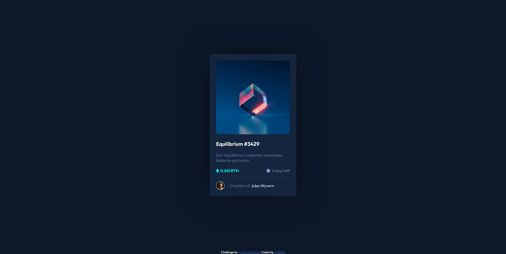

# Frontend Mentor - NFT preview card component solution

This is a solution to the [NFT preview card component challenge on Frontend Mentor](https://www.frontendmentor.io/challenges/nft-preview-card-component-SbdUL_w0U). Frontend Mentor challenges help you improve your coding skills by building realistic projects. 

## Table of contents

- [Overview](#overview)
  - [Screenshot](#screenshot)
  - [Links](#links)
- [My process](#my-process)
  - [Built with](#built-with)
  - [What I learned](#what-i-learned)
- [Author](#author)

## Overview

### Screenshot

### Links

- Solution URL: [Frontend Mentor Solution](https://your-solution-url.com)
- Live Site URL: [Live Site via github](https://unl00ky.github.io/nft-card-challenge/)

## My process

### Built with

- Semantic HTML5 markup
- CSS custom properties
- Flexbox
- Mobile-first workflow

### What I learned

I don't like position absolute and animations

## Author

- Github - [unl00ky](https://github.com/unl00ky)
- Frontend Mentor - [@unl00ky](https://www.frontendmentor.io/profile/unl00ky)

